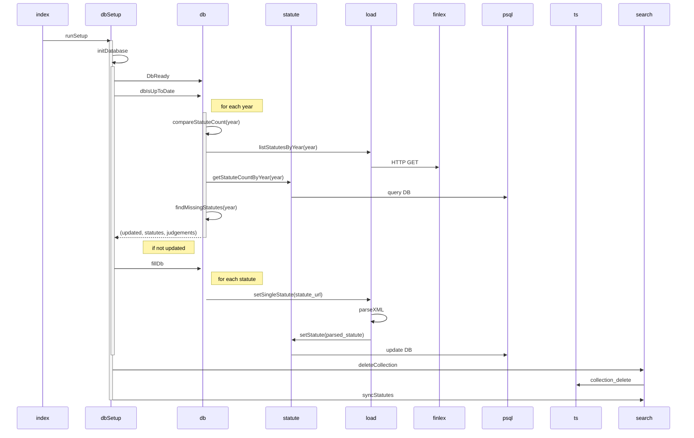
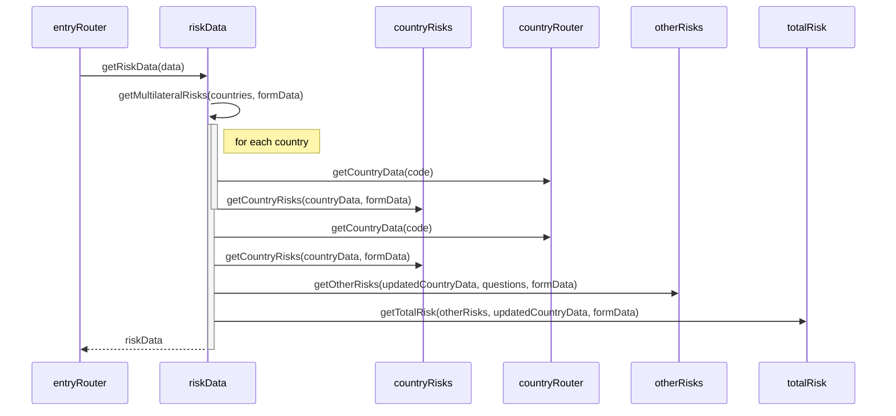
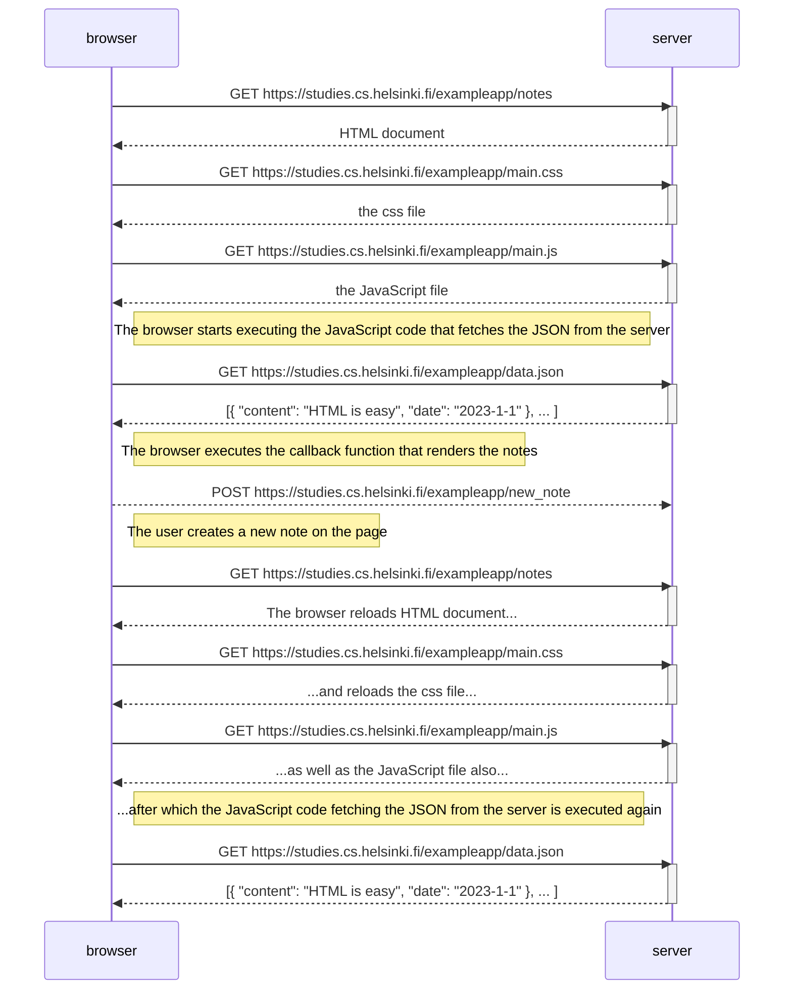

```mermaid
sequenceDiagram
  participant index
  participant dbSetup
  participant db
  participant statute
  participant load
  participant finlex
  participant psql
  participant ts

  index ->> dbSetup: runSetup
  activate dbSetup
  dbSetup ->> dbSetup: initDatabase
  activate dbSetup
  dbSetup ->> db: DbReady
  dbSetup ->>+ db: dbIsUpToDate
  Note right of db: for each year
  activate db
  db ->> db: compareStatuteCount(year)
  db ->> load: listStatutesByYear(year)
  load ->> finlex: HTTP GET
  db ->> statute: getStatuteCountByYear(year)
  statute ->> psql: query DB
  db ->> db: findMissingStatutes(year)
  db -->> dbSetup: (updated, statutes, judgements)
  deactivate db
  Note left of db: if not updated
  dbSetup ->> db: fillDb
  activate db
  Note right of db: for each statute
  db ->> load: setSingleStatute(statute_url)
  load ->> load: parseXML
  load ->> statute: setStatute(parsed_statute)
  statute ->> psql: update DB
  deactivate dbSetup
  dbSetup ->> search: deleteCollection
  search->>ts: collection_delete
  dbSetup ->> search: syncStatutes
  deactivate dbSetup
```

```mermaid
sequenceDiagram
    participant entryRouter
    participant riskData
    participant countryRisks
    participant countryRouter
    participant otherRisks
    participant totalRisk

    entryRouter->>riskData: getRiskData(data)
    activate riskData
    riskData ->>+ riskData: getMultilateralRisks(countries, formData)
    activate riskData
    Note right of riskData: for each country
    riskData ->> countryRouter: getCountryData(code)
    riskData ->> countryRisks: getCountryRisks(countryData, formData)
    deactivate riskData
    riskData ->> countryRouter: getCountryData(code)
    riskData ->> countryRisks: getCountryRisks(countryData, formData)
    riskData ->> otherRisks: getOtherRisks(updatedCountryData, questions, formData)
    riskData ->> totalRisk: getTotalRisk(otherRisks, updatedCountryData, formData)
    riskData -->> entryRouter: riskData
    deactivate riskData
```

```mermaid
sequenceDiagram
    participant browser
    participant server

    browser->>server: GET https://studies.cs.helsinki.fi/exampleapp/notes
    activate server
    server-->>browser: HTML document
    deactivate server

    browser->>server: GET https://studies.cs.helsinki.fi/exampleapp/main.css
    activate server
    server-->>browser: the css file
    deactivate server

    browser->>server: GET https://studies.cs.helsinki.fi/exampleapp/main.js
    activate server
    server-->>browser: the JavaScript file
    deactivate server

    Note right of browser: The browser starts executing the JavaScript code that fetches the JSON from the server

    browser->>server: GET https://studies.cs.helsinki.fi/exampleapp/data.json
    activate server
    server-->>browser: [{ "content": "HTML is easy", "date": "2023-1-1" }, ... ]
    deactivate server

    Note right of browser: The browser executes the callback function that renders the notes

    browser-->>server: POST https://studies.cs.helsinki.fi/exampleapp/new_note
    Note right of browser: The user creates a new note on the page

    browser->>server: GET https://studies.cs.helsinki.fi/exampleapp/notes
    activate server
    server-->>browser: The browser reloads HTML document...
    deactivate server

    browser->>server: GET https://studies.cs.helsinki.fi/exampleapp/main.css
    activate server
    server-->>browser: ...and reloads the css file...
    deactivate server

    browser->>server: GET https://studies.cs.helsinki.fi/exampleapp/main.js
    activate server
    server-->>browser: ...as well as the JavaScript file also...
    deactivate server

    Note right of browser: ...after which the JavaScript code fetching the JSON from the server is executed again

    browser->>server: GET https://studies.cs.helsinki.fi/exampleapp/data.json
    activate server
    server-->>browser: [{ "content": "HTML is easy", "date": "2023-1-1" }, ... ]
    deactivate server
```
