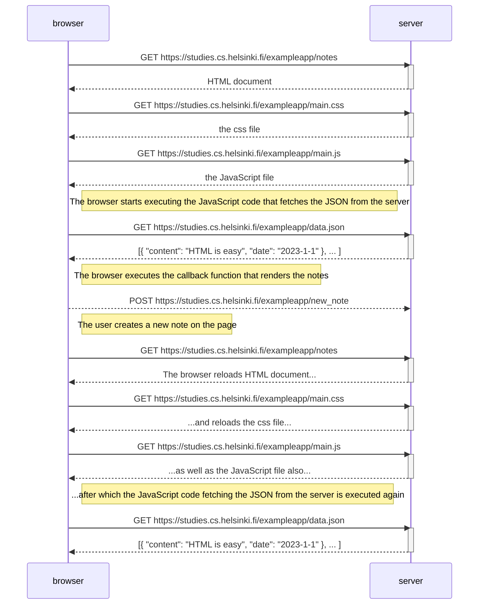

```mermaid
sequenceDiagram
    participant entry
    participant riskData
    participant countryRisks
    participant countryRouter

    entry->>riskData: getRiskData(data)
    riskData ->>+ riskData: getMultilateralRisks(countries, formData)
    riskData ->> countryRouter: getCountryData
    riskData ->> countryRisks: getCountryRisks
    riskData ->>- riskData

```


